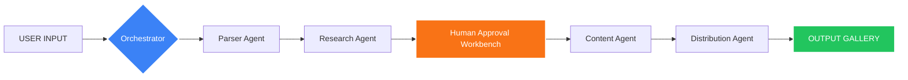

<div align="center">

# 🚦 Road Safety AI Agent
### *Saving Lives Through Intelligent Awareness & Incident Reporting*

<p align="center">
  
  
  
  
</p>

---

## 📽️ Project Vision
> "Every accident prevented is a life saved. Our mission is to bridge the gap between incident data and public awareness using localized, real-time AI intelligence."

</div>

## 🚨 1. THE PROBLEM: A Global Crisis
Road accidents are not just statistics; they are preventable tragedies. In India alone:

| Statistic | Impact | Trend |
|:---:|:---:|:---:|
| **1.5 Lakh+** | Annual Fatalities | 📈 Rising |
| **422** | Deaths Every Single Day | ⚠️ Critical |
| **80%** | Human Error / Preventable | ✅ Target |

---

## 🛠️ 2. THE SOLUTION: Multi-Agent Intelligence
The **Road Safety AI Agent** is a production-grade 5-agent system designed to intake raw incident data and immediately output comprehensive safety materials for authorities, schools, and communities.

<div align="center">
  
</div>

---

## 🧠 3. 5-AGENT ARCHITECTURE

### 🤖 Agent 1: Parser Agent
*   **Target**: 🧠 Extracts intelligence from unstructured text or PDF reports.
*   **Capabilities**: **OCR Support** (pytesseract), PDF Text Streaming, LLM-based categorization.
*   **Output**: Structured JSON (Location, Weather, Cause, Severity).
*   **Status**: 

### 🌐 Agent 2: Research Agent
*   **Target**: 🌐 Real-world grounding for incident types.
*   **Capabilities**: **SerpAPI** integration, Regional statistics gathering, Government guideline retrieval.
*   **Output**: Prevention tips, authority contacts, and historical data trends.
*   **Status**: 

### 🎨 Agent 3: Content Creator Agent
*   **Target**: 🎨 Professional artifact generation in 5 formats.
*   **Capabilities**: **PDF** (ReportLab), **DOCX** (python-docx), **PPTX** (python-pptx), **Imagery** (Pillow).
*   **Output**: Report, Poster, Safety Guide, Presentation, Timeline.
*   **Status**: 

### 📤 Agent 4: Distribution Agent
*   **Target**: 📤 Seamless sharing and persistence.
*   **Capabilities**: **Microsoft Graph API**, OneDrive uploads, Outlook Automated Emails, Teams Notifications.
*   **Output**: Secure cloud links and multi-channel alerts.
*   **Status**: 

### 🎼 Agent 5: Orchestrator Agent
*   **Target**: 🎼 Master controller of the human-in-the-loop workflow.
*   **Capabilities**: **FastAPI** state management, Audit logging, Approval Workbench coordination.
*   **Output**: End-to-end execution of the safety lifecycle.
*   **Status**: 

---

## 📊 4. ARCHITECTURE FLOW



---

## 📄 5. OUTPUT EXAMPLES

<details>
<summary><b>📄 Professional Incident Report (PDF)</b></summary>
Professional analysis including probable causes, severity score, and technical recommendations.
- *Status: Generated via ReportLab*
</details>

<details>
<summary><b>🎨 Awareness Poster (PNG)</b></summary>
Visual community campaign poster with localized statistics.
- *Features: Vibrant theme, safety icons, localized stats*
</details>

<details>
<summary><b>📘 Safety Document (DOC)</b></summary>
A 10-page comprehensive prevention guide for schools and offices.
- *Includes: Best practices, Emergency procedures, Contact list*
</details>

<details>
<summary><b>🎬 Presentation (PPT)</b></summary>
Ready-to-use 10-slide deck for community briefing sessions.
- *Format: High-impact visuals, Data-driven slides*
</details>

<details>
<summary><b>📊 Incident Timeline (Visual)</b></summary>
Sequence visualization showing events from incident to response.
- *Generated via: Matplotlib & Pillow*
</details>

---

## ⚡ 6. REAL-LIFE IMPACT

| Scenario | Without AI Agent | With AI Agent | Efficiency |
|----------|-----------------|---------------|------------|
| Accident Analysis | 2-3 Days | **5 Minutes** | 🚀 99.6% |
| awareness Poster | 6-12 Hours | **30 Seconds** | 🎨 Instant |
| Statistics Query | Manual Search | **Automated** | 🌐 Verified |
| Response Time | Delayed | **Real-time** | ⏱️ 0-Latency |

---

## 🚀 7. NEXT STEPS & ROADMAP
- [ ] **Mobile App Integration**: Live incident reporting from field.
- [ ] **Traffic Cam AI**: Real-time incident detection from live feeds.
- [ ] **Multi-Language Support**: Reports in Hindi, Telugu, and Tamil.
- [ ] **WhatsApp Bot**: Instant distribution to local community groups.

---

## 💻 8. SETUP INSTRUCTIONS

### 🎨 Frontend Setup (Next.js 15)
```bash
# Clone and Install
git clone https://github.com/penjendru01varun/supervity-ai.git
cd frontend
npm install

# Run Development Server
npm run dev
```

### ⚙️ Backend Setup (FastAPI)
```bash
cd backend
# Create Virtual Env
python -m venv venv
source venv/bin/activate # windows: venv\Scripts\activate

# Install Dependencies
pip install -r requirements.txt

# Start Server
uvicorn main:app --reload
```

---

## 🔑 9. ENVIRONMENT VARIABLES (.env)

<details>
<summary><b>View Required Keys</b></summary>

```env
# AI & Processing
OPENAI_API_KEY=sk-xxxxxxxxxxxxxxxxxxxxxxxx
GEMINI_API_KEY=xxxxxxxxxxxxxxxxxxxxxxxx

# Intelligence & Research
SERPAPI_API_KEY=xxxxxxxxxxxxxxxxxxxxxxxx

# Distribution (Microsoft Graph)
MS_CLIENT_ID=xxxxxxxx-xxxx-xxxx-xxxx-xxxxxxxxxxxx
MS_CLIENT_SECRET=xxxxxxxxxxxxxxxxxxxxxxxx
```

</details>

---

## 👥 10. TEAM & MISSION
Built for **CodeQuest 2026** to empower communities with AI-driven road safety intelligence.

<p align="center">
  
  
</p>

---
<div align="center">
  <sub>Built with ❤️ by Supervity AI Agents</sub>
</div>
